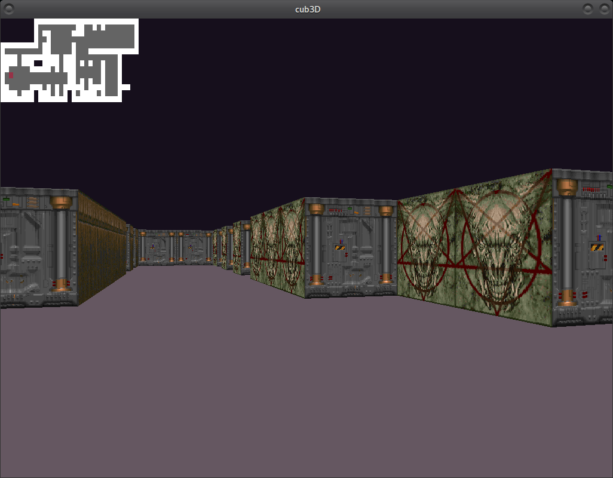

# Cub3D ~

### ~ a 42 School graphics project. Grade : 110/100.

Here it is, with textures sourced from Doom WADs, credit to id Software for these beauties.

## Goal	
#### Taking at stab at a raycasting engine.
Because a far fetched notion of what it takes to be a "proper" engineer apparently involves agonizing over some maths... or at least be able to get them to work for your problems.

## Usage

## Constraints ~
No OpenGL, no SDL... just a spartan homebrewed graphics lib from 42 school with rudimentary window and events management... and the ability to print a single pixel to a screen or a buffer.

## Interest ~
Injecting some trigonometry to what was once a great applied IT cursus to meet governmental requirements for engineering degrees... and probably the subsidies they entitle.

As a former student of the history of technology, I was more enthusiastic about the potential for this project as an historical experiment. Putting ourselves in the shoes of Carmack and Romero, and as the former, using the state of the art in scholarly mathematics to display 3D graphics with 2D calculations.

A lesson in craftiness, sobriety and optimisation... also Doom was my first video game so it was exciting to get a peek under its hood !

## Technique ~
Vectorial 2D raycasting, as featured in lodev's ubiquital reference on the subject (https://lodev.org/cgtutor/raycasting.html).

As I have a mental block on mathematics and lack culture on the matter as well, I felt the elemental logic of vectors was much more concrete and approachable than the lingo laden angle calculations of some other methods (https://www.youtube.com/watch?v=eOCQfxRQ2pY).

## Implementation ~ 

## Bonuses ~
#### Collisions
Easily implemented thanks to the design choices explained above. Also seemed the easiest way to avoid segmentation faults from the get go.

#### Minimap
A breeze thanks to the scaling calculations used earlier in the so_long 2D, top down maze game project and a nifty design choice :

I chose to round the actual position of the camera (a float) to and int thanks to a cast.

The position of the player is then reduced to the map tile he is currently in, BUT it saved me from additional calculations. It is rudimentary, but turns out to be useful for debugging collisions, and super cute as well!
